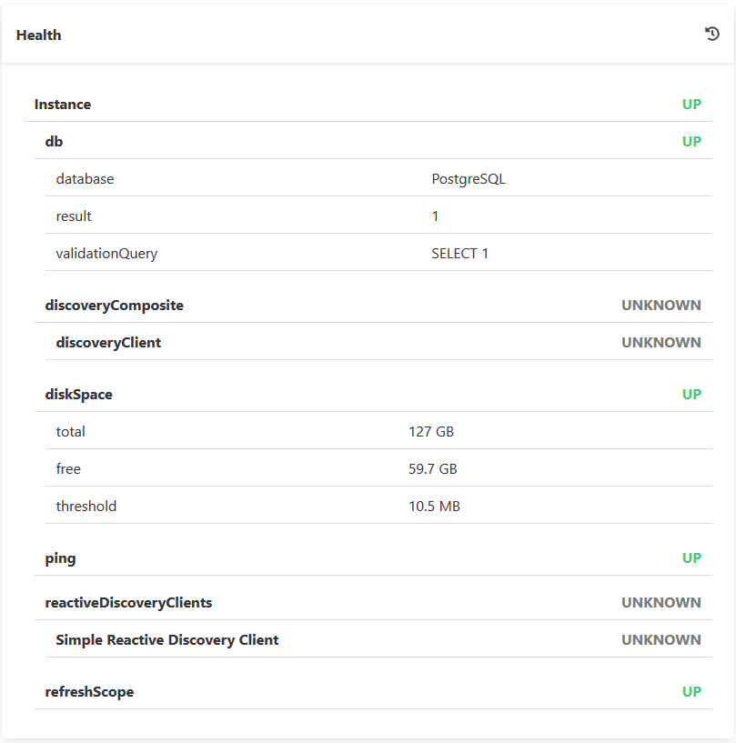
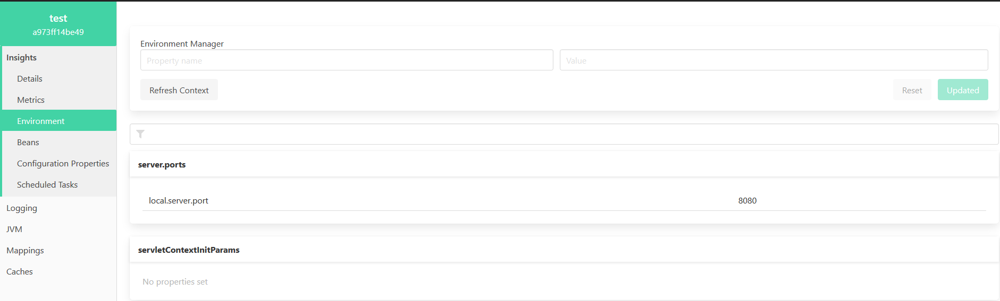
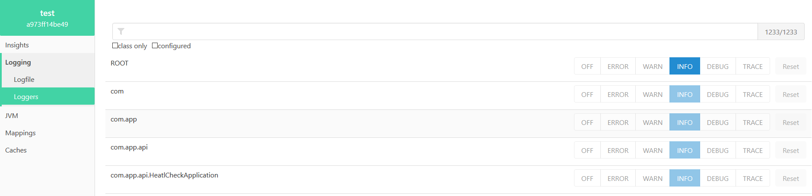

# Health Check In Spring Boot

Cómo monitorizar microservicios con Spring Boot Admin

## Documentaciones

- [Spring Boot Admin Reference Guide](https://codecentric.github.io/spring-boot-admin/2.2.1/)
- [Cómo monitorizar microservicios con Spring-Boot-Admin](https://www.paradigmadigital.com/dev/monitorizar-microservicios-spring-boot-admin/)

## Configurar Spring Boot Admin

Para configurar Spring Boot Admin en un proyecto, primero debe realizar el proceso de instalar las dependencias y configuraciones necesarias, tal como se muestra a continuación:

### Inicializar proyecto

Para inicializar el proyecto se recomienda utilizar [Spring Initializr](https://start.spring.io/) y configurar las siguientes dependencias para el proyecto en cuestión.


Adicionalmente, se deben agregar las dependencias de Swagger como se muestra a continuación:

**Maven**

```
<dependency>
    <groupId>io.springfox</groupId>
    <artifactId>springfox-swagger2</artifactId>
    <version>2.9.2</version>
</dependency>

<dependency>
    <groupId>io.springfox</groupId>
    <artifactId>springfox-swagger-ui</artifactId>
    <version>2.9.2</version>
</dependency>
```

**Gradle**

```
compile 'io.springfox:springfox-swagger2:2.9.2'
compile 'io.springfox:springfox-swagger-ui:2.9.2'
```

### Configurando Archivos

Una vez se completa el proceso de instalación de las dependencias se debe proceder a configurar tanto el archivo main.java, así como también el archivo YML o propierties de nuestro proyecto, para este ejemplo se utilizará un archivo YML.

#### Main.java

Se deben agregar las siguientes líneas para importar las librerías correspondientes.

```
@EnableAdminServer
@EnableSwagger2
@EnableJpaAuditing
```

#### application.yml

Se debe añadir las siguientes instrucciones en nuestro archivo YML para configurar nuestro servidor, así como nuestro monitoreo del proyecto.

**Configurando Base de datos**

Conexión a la base de datos local.

```
# DB CONFIG
spring:
  datasource:
    url: jdbc:postgresql://localhost:5432/test
    password: pacho
    username: postgres

  jpa:
    properties:
      hibernate.dialect: org.hibernate.dialect.PostgreSQLDialect
    hibernate.ddl-auto: update
```

**Configurando Spring Boot Admin**

Configuracion de las instancias de nuestro respectivo proyecto.

```
# SPRING BOOT ADMIN CONFIG    
  boot:
    admin:
      context-path: /admin
      
  cloud:
    discovery:
      client:
        simple:
          instances:
            test:
              - uri: http://localhost:8080
#              - uri: http://localhost:8082
                metadata:
                  management.context-path: /actuator
#            testB:
#              - uri: http://localhost:8081
#                metadata:
#                  management.context-path: /actuator
```

**Exponiendo Endpoints**

Estos serán los modulos que mostrará nuestro actuator, y al mismo tiempo, tambien nos permitirá visualizarlos en nuestro menú de Spring Boot Admin.

```
# HEALTH ENDPOINT
management:
  endpoint:
    shutdown:
      enabled: true
     
    health:
      show-details: always
  # Use "*" to expose all endpoints, or a comma-separated list to expose selected ones      
  endpoints:
    web:
      exposure:
        include: '*'
```

**Configurando la Información a mostrar en la pantalla**

Esta información se toma directamente de las variables de entorno las cuales se pueden consultar facilmente en la pestaña enviroment que se crea a partir de su llamada en el YML.

```
info:
  app: 
    name: ${spring.boot.project.name}
    description: Test of Health Check
    version: 0.0.1-SNAPSHOT
    port: ${local.server.port}
    PID: ${PID}
  java:
    vendor: ${java.vm.vendor}
    version: ${java.version}
    hostname: ${java.rmi.server.hostname}
  user:
    name: ${user.name}
    timezone: ${user.timezone}
    country: ${user.country}
  jpa:
    properties:
      hibernate:
        dialect:${spring.jpa.properties.hibernate.dialect}
```

**Configurando Puertos**

En esta parte se configura el puerto por defecto de nuestra aplicación.

```
uri: http://localhost:8080

server:
  port: 8080
```

**Configurando Endpoint Home**

Con esta configuración se podrá redireccionar desde la url que tenemos para impedir que el usuario se dirija al directorio raiz de nuestro proyecto.

*En ApplicationController.*

```
package com.app.api.controller;

import javax.servlet.http.HttpServletRequest;

import org.springframework.beans.factory.annotation.Value;
import org.springframework.context.annotation.Bean;
import org.springframework.context.annotation.Configuration;
import org.springframework.stereotype.Controller;
import org.springframework.web.bind.annotation.GetMapping;

import com.google.common.base.Predicates;

import springfox.documentation.builders.PathSelectors;
import springfox.documentation.builders.RequestHandlerSelectors;
import springfox.documentation.spi.DocumentationType;
import springfox.documentation.spring.web.plugins.Docket;

@Configuration
@Controller
public class ApplicationController {

	@Bean
	public Docket api() {
	return new Docket(DocumentationType.SWAGGER_2)
	    .select()
	    .apis(RequestHandlerSelectors.any())
	    .paths(PathSelectors.any())
	    .paths(Predicates.not(PathSelectors.regex("/error.*")))
	    .paths(Predicates.not(PathSelectors.regex("/admin.*")))
	    .paths(Predicates.not(PathSelectors.regex("/actuator.*")))
	    .paths(Predicates.not(PathSelectors.regex("/")))
	    .build();
	}
	
	@Value("${uri}")
	private String hostUrl;
	
	@GetMapping("/")
	public String redirectToAdmin(HttpServletRequest request) {
		String homeUrl = hostUrl;
		return "redirect:".concat(homeUrl).concat("/admin").concat("/wallboard");
	}

}
```

**Configurando Logfile**

Con el siguiente codigo, se le permite a Spring Boot Admin generar archivos log que posteriormente se podrán exportar para llevar un registro.

```
# CREATE LOGFILE
logging:
  file: /var/log/sample-boot-application.log
  pattern:
    file: '%clr(%d{yyyy-MM-dd HH:mm:ss.SSS}){faint} %clr(%5p) %clr(${PID}){magenta} %clr(---){faint} %clr([%15.15t]){faint} %clr(%-40.40logger{39}){cyan} %clr(:){faint} %m%n%wEx'
```

Para finalizar, se debe proceder a iniciar el proyecto y acceder por medio del id o el wallboard de nuestra instancia creada por el proyecto.

## Acerca de Spring Boot Admin

### Spring Boot Actuator

Según su propia definición en la documentación de Spring se trata de *“una serie de características adicionales que te ayudan a monitorizar y gestionar tu aplicación cuando es desplegada en producción”*. En esencia spring-boot-actuator nos proporciona por defecto una serie de endpoints en los que poder consultar información relativa a nuestra aplicación.

### Endpont Shutdown True

el endpoint /shutdown que nos permite apagar nuestra aplicación por defecto está deshabilitado, si quisiéramos por ejemplo activarlo, securizarlo y cambiarlo a la URL /apagar tendríamos que incluir las siguientes propiedades:

```
endpoints:
    shutdown:
        enabled: true
```    

### Endpoint de estado



Spring Boot Actuator realiza el control del estado a través del endpoint health. A nivel de implementación Spring nos proporciona unos cuantos HealthIndicator por defecto que serán autoconfigurados según las dependencias de nuestro proyecto. Así tenemos HealthIndicators para dataSources, disco, colas… además de la posibilidad de implementar el nuestro propio y añadirlo a los demás.
Otro de los efectos colaterales de incluir la dependencia de spring-security en nuestro proyecto es la información devuelta por el endpoint de estado. Incluso desecurizando el endpoint se evitará devolver información sensible sobre los elementos que componen el estado de nuestra aplicación.

### Environment



En la pantalla de Environment podemos ver el perfil con el que se ejecuta la aplicación, las variables de sistema y propiedades, así como modificarlas.

### Logging



En esta pantalla podemos ver el nivel de log de las diferentes clases y librerías que componen nuestra aplicación, así como cambiar su nivel de log en caliente. Para ello es necesario añadir la dependencia de jolokia:

`compile group: 'org.jolokia', name: 'jolokia-core', version: '1.6.2'`

También hay que añadir la siguiente línea en nuestro fichero de configuración de logback:

`**`

**IMPORTANTE:** esta funcionalidad solo es compatible actualmente con logback, no funcionará con otras librerías de log.
