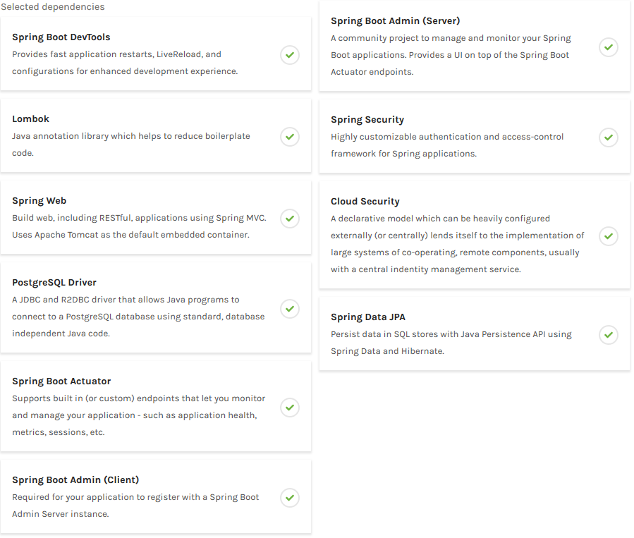

# Health Check In Spring Boot

Cómo monitorizar microservicios con Spring Boot Admin

## Documentaciones

[Spring Boot Admin Reference Guide](https://codecentric.github.io/spring-boot-admin/2.2.1/)
[Cómo monitorizar microservicios con Spring-Boot-Admin](https://www.paradigmadigital.com/dev/monitorizar-microservicios-spring-boot-admin/)

## Configurar Spring Boot Admin

Para configurar Spring Boot Admin en un proyecto, primero debe realizar el proceso de instalar las dependencias y configuraciones necesarias, tal como se muestra a continuación:

### Inicializar proyecto

Para inicializar el proyecto se recomienda utilizar [Spring Initializr](https://start.spring.io/) y configurar las siguientes dependencias para el proyecto en cuestión.



Adicionalmente, se deben agregar las dependencias de Swagger como se muestra a continuación:

**Maven**

```
<dependency>
    <groupId>io.springfox</groupId>
    <artifactId>springfox-swagger2</artifactId>
    <version>2.9.2</version>
</dependency>

<dependency>
    <groupId>io.springfox</groupId>
    <artifactId>springfox-swagger-ui</artifactId>
    <version>2.9.2</version>
</dependency>
```

**Gradle**

```
compile 'io.springfox:springfox-swagger2:2.9.2'
compile 'io.springfox:springfox-swagger-ui:2.9.2'
```

### Configurando Archivos

Una vez se completa el proceso de instalación de las dependencias se debe proceder a configurar tanto el archivo main.java, así como también el archivo YML o propierties de nuestro proyecto, para este ejemplo se utilizará un archivo YML.

#### Main.java

Se deben agregar las siguientes líneas para importar las librerías correspondientes.

```
@EnableAdminServer
@EnableSwagger2
@EnableJpaAuditing
```

#### application.yml

Se debe añadir las siguientes instrucciones en nuestro archivo YML para configurar nuestro servidor, así como nuestro monitoreo del proyecto.

**Configurando Base de datos**

```
# DB CONFIG
spring:
  datasource:
    url: jdbc:postgresql://localhost:5432/test
    password: pacho
    username: postgres

  jpa:
    properties:
      hibernate.dialect: org.hibernate.dialect.PostgreSQLDialect
    hibernate.ddl-auto: update
```

**Configurando Spring Boot Admin**

```
# DB CONFIG
# SPRING BOOT ADMIN CONFIG    
  boot:
    admin:
      context-path: /admin
      
  cloud:
    discovery:
      client:
        simple:
          instances:
            test:
              - uri: http://localhost:8080
                metadata:
                  management.context-path: /actuator
```

**Exponiendo Endpoints**

```
# HEALTH ENDPOINT
management:
  endpoint:
    shutdown:
      enabled: true
     
    health:
      show-details: always
  # Use "*" to expose all endpoints, or a comma-separated list to expose selected ones      
  endpoints:
    web:
      exposure:
        include: '*'
```

**Configurando la Información a mostrar en la pantalla**

```
info:
  app: 
    name: ${spring.boot.project.name}
    description: Test of Health Check
    version: 0.0.1-SNAPSHOT
    port: ${local.server.port}
    PID: ${PID}
  java:
    vendor: ${java.vm.vendor}
    version: ${java.version}
    hostname: ${java.rmi.server.hostname}
  user:
    name: ${user.name}
    timezone: ${user.timezone}
    country: ${user.country}
  jpa:
    properties:
      hibernate:
        dialect:${spring.jpa.properties.hibernate.dialect}
```

**Configurando Logfile**

```
# CREATE LOGFILE
logging:
  file: /var/log/sample-boot-application.log
  pattern:
    file: '%clr(%d{yyyy-MM-dd HH:mm:ss.SSS}){faint} %clr(%5p) %clr(${PID}){magenta} %clr(---){faint} %clr([%15.15t]){faint} %clr(%-40.40logger{39}){cyan} %clr(:){faint} %m%n%wEx'
```

## Acerca de Spring Boot Admin

